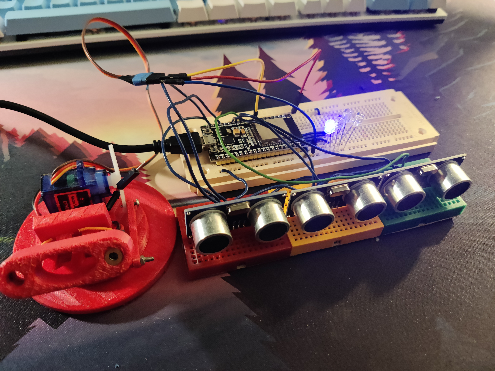
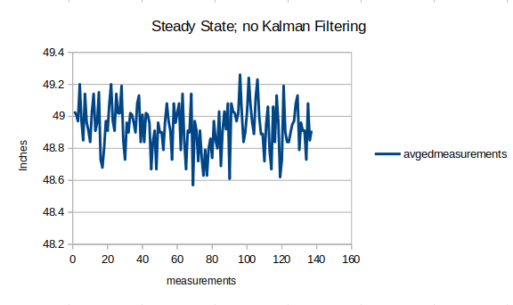
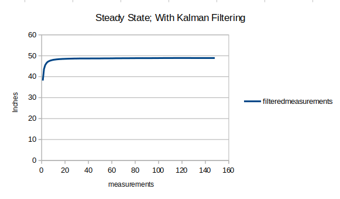
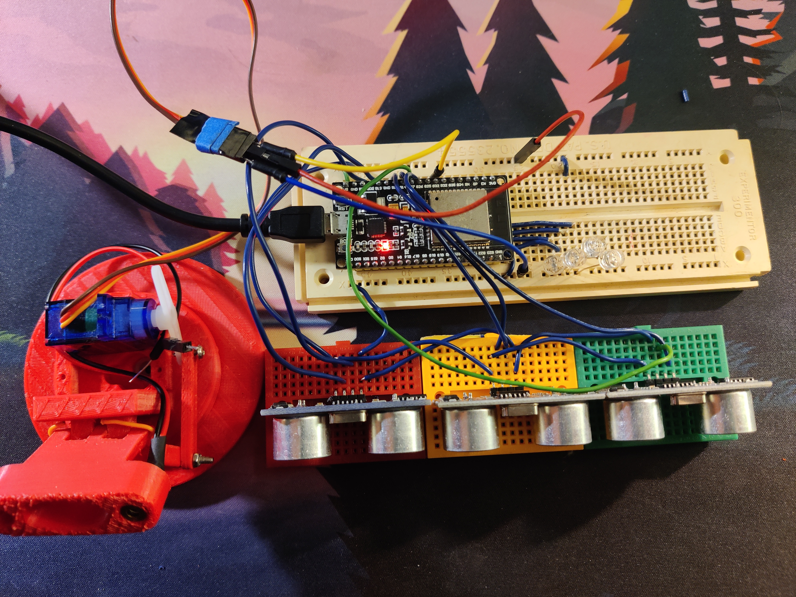
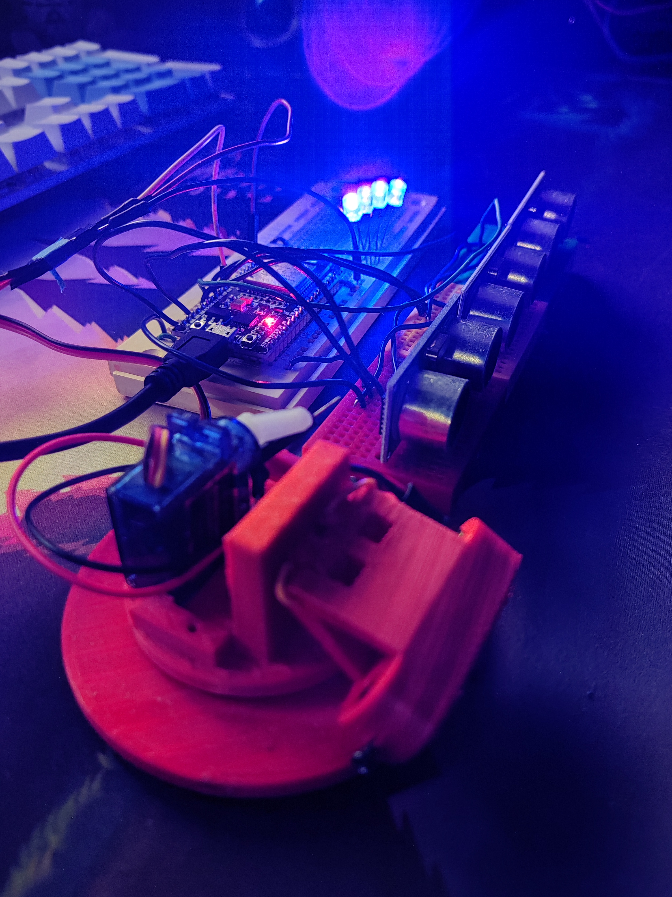
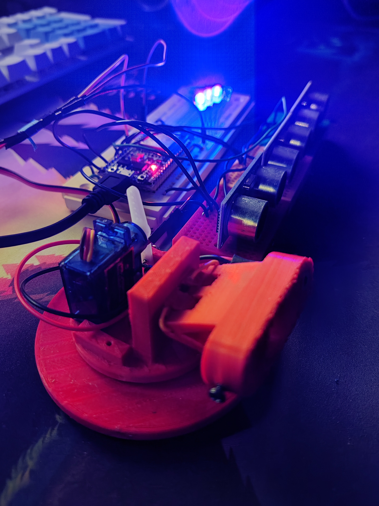
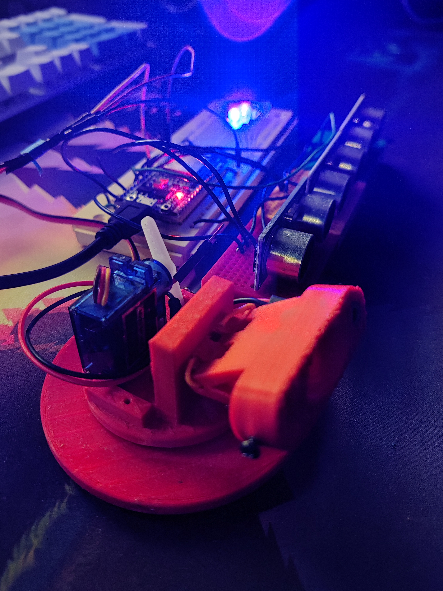
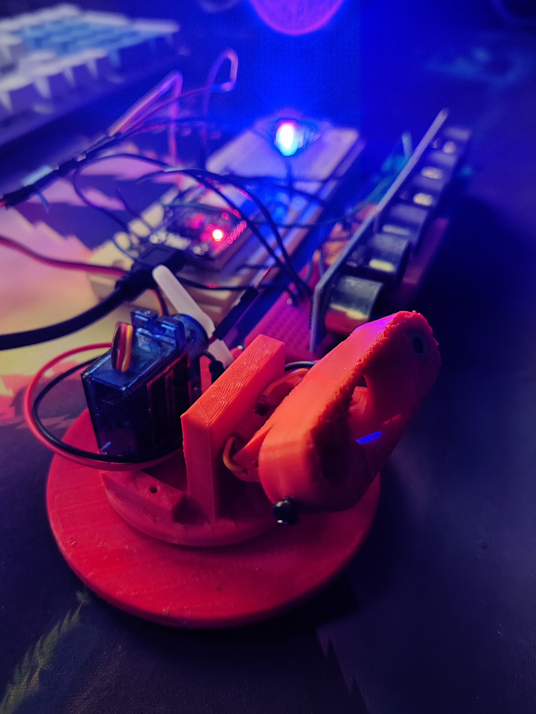

# kalmanFilter_with_hc-sr04
This is a simple project to demonstrate how to use a Kalman filter to fuse multiple HC-SR04 ultrasonic sensors together 

# Libraries

ESP32 server library used: https://registry.platformio.org/libraries/madhephaestus/ESP32Servo

Standard Arduino Library: https://github.com/arduino/Arduino

# Hardware
This code uses:

    1 ESP32 microcontroller
    3 HC-SR04 ultrasonic (US) distance sensors  
    4 LEDs
    1 DF9GMS servo motor.

The HC-SR04 has range of 2-400 cm and a baud rate of 9600.

# Brief
This project aims to demonstraight the effectivness of a Kalman filter so fuse multiple sensors together to create a more ruobust measurement. 

Using this improved distance measurement I attached a servo to move a "robot" to loop up at you as you approach. 

# Design

The basic flow is:

    - measure sensors, 
    - print distance,
    - save distance to array,
    - display distance via the LEDs and Servo.

    After 10 seconds send the full array over serial to the computer. This allows the user to grab the data and graph it if desired. 

In `variables.h` there are two variables that allow you to change how the system behaves.

    1) useKalmanFilter
            This turns on/off the Kalman filter. 
                Kalman Filter Mode: 
                    When using the Kalman filter the system updates the kalman filter for all three sensors each iteration then saves the distance into the array. 
                No Kalman Filter Mode:
                    When the Kalman filter is turned off the system measures all three US sensors then simply takes the average and saves that as the distance. 
    2) inORcm
            Changes the units of measurment between cm and inches (0 for inches and 1 for cm)

# Results
The output of the system was captured for a steady state run where a wall was 49 inches directly in front of the sensors. 
The resulting array was then saved to `steadyStateMeasurements.ods` and graphed. 
The graphs are saved in `steadyStateMeasurements.ods` and as images: `kalmanFilteredMeasurements.png` & `3avgedMeasurements.png`

As shown in the graphs, the Kalman filtering completely eliminates the noise. 

# Real World Implementation

## Below shows how the setup moves depending on the distance 
### NOTE: The servo moves in a smooth arch 5 discrete locations...
### 80cm away

### 60 cm away

### 40 cm away

### 20 cm away

### < 20 cm away
